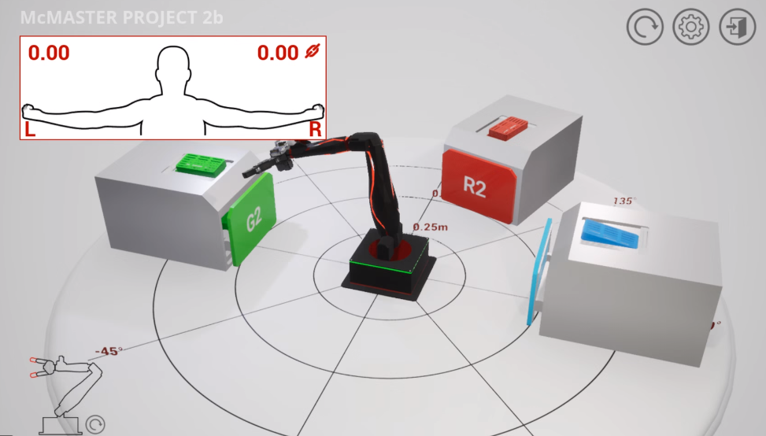
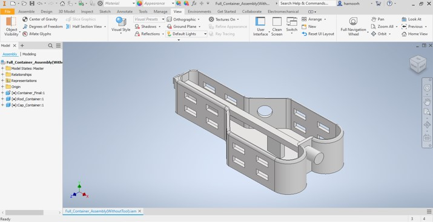

# Remote Sensing Sterilization System

McMaster ENGINEER 1P13, Nov 2021 – Dec 2021.

Python programmed robotic arm that autonomously identifies, sorts by size, and deposits sterilization containers into their correct autoclave locations.

`Python` `Raspberry Pi` `Quanser Interactive Labs` `Robotics`

 
<em>Autoclave Bins and Sterilization Containers Within the Quanser Interactive Labs Environment after being Correctly Sorted.</em>

---

## Table of Contents
- [Overview](#overview)
- [Hardware & Software](#hardware--software)
- [System Workflow](#system-workflow)
- [How It Works](#how-it-works)
  - [1. Container Identification & Bin Mapping](#1-container-identification--bin-mapping)
  - [2. Pickup, Gripper & Drawer Control](#2-pickup-gripper--drawer-control)
  - [3. Sensor Gated Sequencing](#3-sensor-gated-sequencing)
  - [4. Container Design](#4-container-design)
- [Results](#results)
- [Full Report](#full-report)

---

## Overview

This project addresses the need for a system that can safely transfer surgical tool containers into an autoclave for sterilization without manual handling. The finished system is a Quanser Q-arm robotic arm, programmed in Python within Quanser Interactive Labs, that identifies each of six containers, transports it to its assigned autoclave bin, and either opens a drawer or places the container on top depending on its size. A container was also modelled in Autodesk Inventor to securely hold surgical scissors using a rod and cap mechanism, with ventilation windows to support the sterilization process.

---

## Hardware & Software

### Hardware

| Component | Purpose |
|---|---|
| Quanser Q-arm | Robotic arm that identifies, picks up, transports, and drops off each sterilization container |
| Sterilization Container | Custom container holding surgical scissors, secured with a rod and cap mechanism and ventilated with side windows |
| Autoclave Bins | Six designated locations, three requiring a drawer to open for large containers and three that receive small containers directly on top |

### Software

| Tool / Library | Purpose |
|---|---|
| Python | Program controlling container identification, bin lookup, arm movement, gripper control, and drawer operation |
| Quanser Interactive Labs (Q-Labs) | Virtual environment simulating the Q-arm, sensor emulator readings, and autoclave bin layout |
| Autodesk Inventor | CAD modelling of the sterilization container, rod, and cap |

---

## System Workflow

| Stage | Function | Output |
|---|---|---|
| Spawning | `main` | A random, non repeating container ID from 1 to 6 spawned into the environment |
| Pickup | `move_end_effector`, `control_gripper` | Arm moves to the pickup location and closes the gripper on the container |
| Bin Lookup | `bin_location` | Container ID mapped to its assigned autoclave bin coordinates |
| Transport | `move_end_effector` | Arm returns to home, then moves to the container's assigned bin |
| Drop Off | `control_drawer`, `control_gripper` | Drawer opens first for large containers, gripper releases the container, drawer closes |
| Return | `move_end_effector` | Arm returns to home before repeating the cycle for the next container |

---

## How It Works

### 1. Container Identification & Bin Mapping

- Six container IDs are defined, with three small and three large containers, each assigned a red, green, or blue autoclave bin.
- The `bin_location` function maps each container ID to a specific xyz coordinate, identified through trial and error within the Quanser Interactive Labs environment.
- At the start of each cycle, the `main` function randomly selects a container ID from a list of six and removes it from the list, ensuring all six containers are spawned exactly once without repetition.

### 2. Pickup, Gripper & Drawer Control

- The `move_end_effector` function always sends the arm back to a fixed home position before moving to any pickup or bin location, keeping motion consistent between cycles.
- The `control_gripper` function closes the gripper to pick up a container and opens it to release one, using a flag value to determine the action.
- The `control_drawer` function only triggers for container IDs 4 to 6 (the large containers), opening the matching red, green, or blue autoclave drawer before the gripper releases the container, then closes it afterward. Small containers skip this step entirely and are placed directly on top of their bin.

### 3. Sensor Gated Sequencing

- Every action in the sequence is gated by two simulated sensor emulator readings, referred to in the program as L and R, which are checked against a threshold of 0.5 before the corresponding step is allowed to execute.
- Arm movement only proceeds once L is above 0.5 and R equals 0.
- Gripper actions require both L and R to be above 0.5.
- Drawer actions require R to be above 0.5 and L to equal 0, and only apply when the container ID indicates it's a large container.
- This gating structure ensures each step in the pickup and drop off sequence only executes once its corresponding condition is confirmed.

### 4. Container Design

- The sterilization container was modelled in Autodesk Inventor to hold surgical scissors securely while fitting within the provided footprint constraints.
- A rod and cap mechanism secures the tool inside the container, replacing a full lid while still keeping the tool from escaping during transport.
- Ventilation windows on each side of the container maximize airflow during the sterilization process.

 
<em>CAD Model of the Final Container Assembly, Showing the Rod and Cap Mechanism and Ventilation Windows.</em>

---

## Results

- The program successfully identified, transferred, and deposited all six containers into their correct autoclave locations without manual intervention.
- Large containers correctly triggered their designated drawer to open, while small containers were consistently placed on top of the bin.
- The final deliverable was a fully functional robotic arm program paired with a container design that held the surgical scissors securely throughout the transfer and sterilization process.

---

## Full Report

[Read the Full Project Report](Files/Sterilizing_Surgical_Tools_using_Remote_Sensing_Report.pdf)
